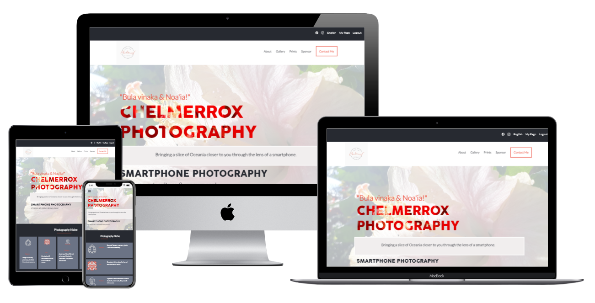

# Chelmerrox Photography

> This is my smartphone photography website that displays most of my photography work using a smartphone. I have built this as part of my Capstone 1 project in Microverse. It encompasses everything that I have learned throughout Module 1 (in Microverse 2.0) & follows design guidelines from Behance.

## Built With

- HTML5
- CSS3
- JavaScript
- Git

## Preview



## Live Demo

[Live Demo Link](https://raw.githack.com/chelmerrox/capstone-1/main/index.html)

## Video presentation

[My video presentation]()

## Getting Started

To get a local copy up and running follow these simple example steps.

### Prerequisites

- HTML5 & CSS3 
- JavaScript
- VSCode (or any other text editor)
- Git
- GitHub
- Command line/Terminal

### Setup

From the command line, do the following steps below:

1. Clone the projects' repository into your machine.

```bash
# Clone this repository
$ git clone git@github.com:chelmerrox/capstone-1.git

```
2. Change directory/Go into the repository with the command below.

```bash
$ cd capstone-1

```

## Author

👤 **Losalini Rokocakau**

- GitHub: [@chelmerrox](https://github.com/chelmerrox)
- Twitter: [@chelmerrox](https://twitter.com/chelmerrox)
- LinkedIn: [Losalini Rokocakau](https://linkedin.com/in/losalini-rokocakau)

## 🤝 Contributing

Contributions, issues, and feature requests are welcome!

Feel free to check the [issues page](https://github.com/chelmerrox/capstone-1/issues).

## Show your support

Give a ⭐️ if you like this project!

## Acknowledgments

- My God & family
- Microverse
- Coding & Learning Partners: 
  1. [Alphayo Wakarindi](https://github.com/alphayowakarindi)
  2. [Pierre Celestin Moussa](https://github.com/Piercel2022) 
- Morning Session Teams
- Stand-Up Teams
- Microverse TSEs
- Cindy Shin from Behance for the design guidelines

## 📝 License

This project is [MIT](./MIT.md) licensed.